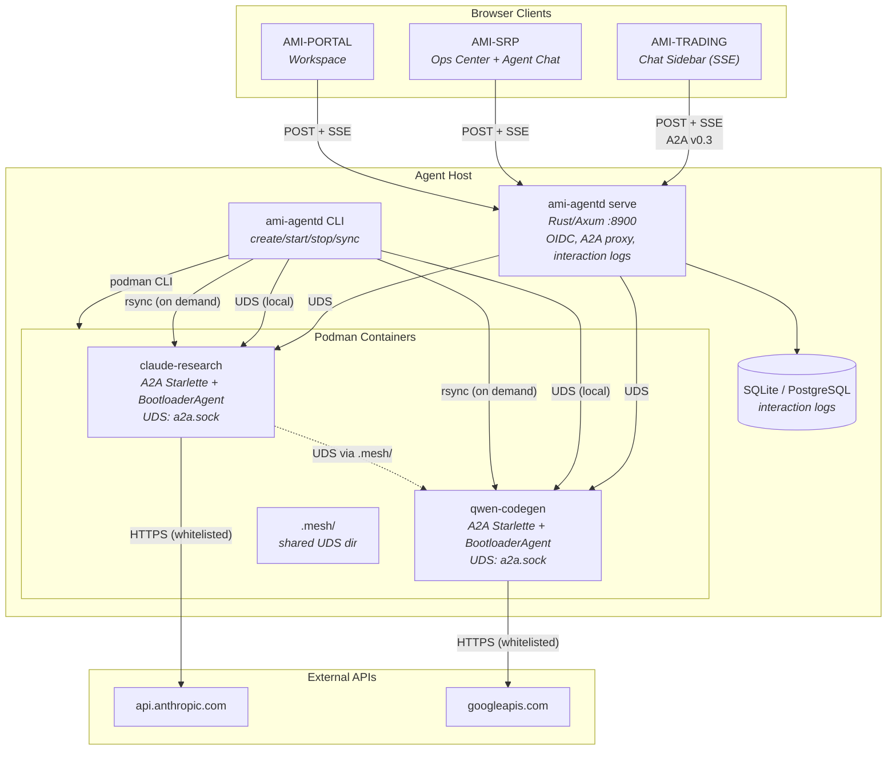
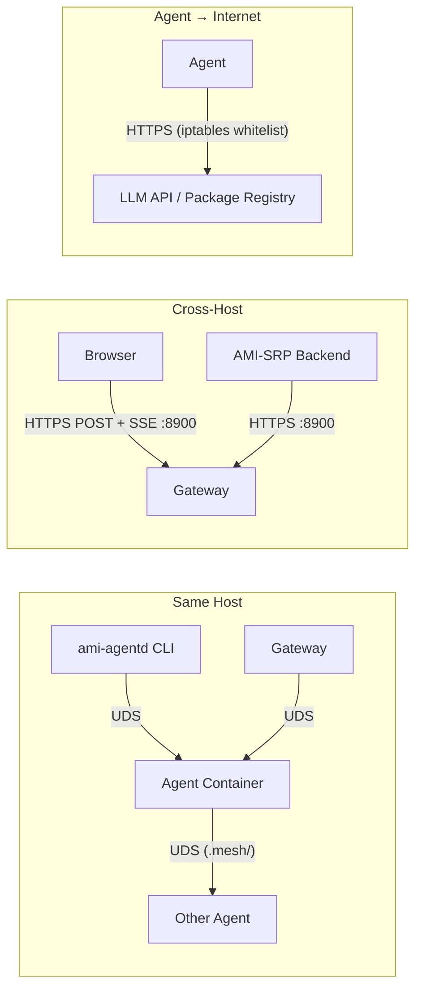
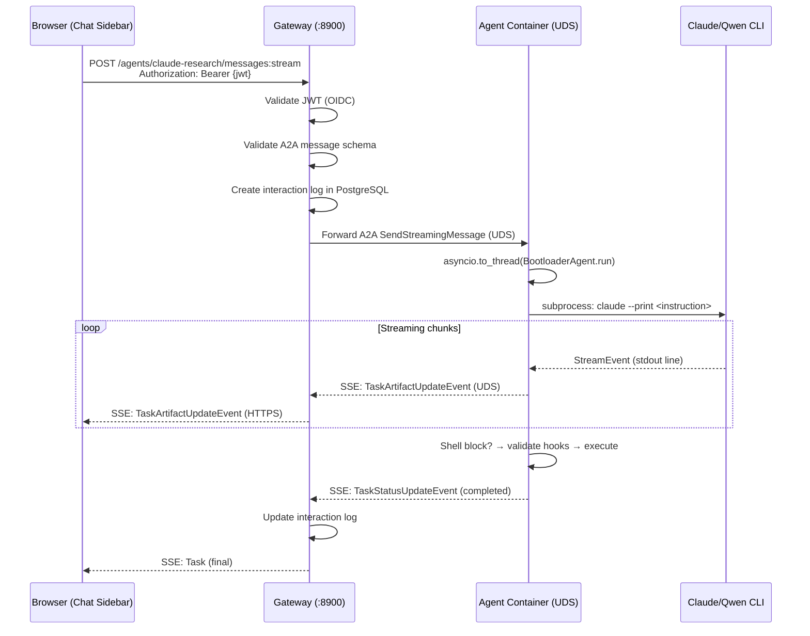
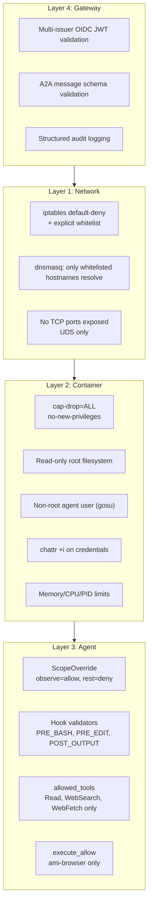

# AMI Agent Ecosystem — Cross-Repo Architecture

> How containerised AI agents, the gateway, chat UI, task engine, and A2A protocol connect across AMI-AGENTS, AMI-TRADING, and AMI-SRP.

---

## System Overview

---

## Component Responsibilities

| Component | Repo | Language | Responsibility |
|-----------|------|----------|----------------|
| **ami-agent** | AMI-AGENTS | Python | The agent itself (BootloaderAgent, ReAct loop). Runs on host AND inside containers. |
| **ami-agentd** | AMI-AGENTS | Rust (Axum) | Single binary: CLI (`create/start/stop/sync`) + gateway server (`serve`). Manages containers via podman, proxies A2A to agent UDS, OIDC auth, TLS, interaction logs (SQLite/PG). **Host only** — disabled inside containers (`AMI_CONTAINER=1`). |
| **Agent Container** | AMI-AGENTS | Python (Starlette + BootloaderAgent) | Runs A2A server on UDS. Executes claude/qwen CLI subprocesses. Isolated filesystem, network whitelist. |
| **Chat Sidebar** | AMI-TRADING | React/TypeScript | Browser UI. Sends POST, receives SSE. Talks to gateway, not agents directly. |
| **srp-tasks** | AMI-SRP | Rust | TODO/planning task engine. Operational task tracking, NOT execution. State machine + PostgreSQL + NATS. |
| **SRP Ops Center** | AMI-SRP | Rust + React | Future: ontology-grounded agent chat, agent monitoring panel. |

---

## Communication Paths

| Path | Transport | Auth | Notes |
|------|-----------|------|-------|
| Browser → Agent | HTTPS POST+SSE → Gateway → UDS | OIDC JWT | Gateway handles TLS + auth |
| CLI → Agent | UDS direct | Filesystem perms | No network, no auth needed |
| Agent ↔ Agent | UDS via `.mesh/` | Mount = access | Only mesh members |
| Agent → LLM API | HTTPS outbound | API key (rsync'd credential) | iptables whitelist enforced |
| Agent → Package Registry | HTTPS outbound | None | DNS whitelist (dnsmasq) |

---

## Data Flow: Chat Message

---

## Security Layers

---

## Repo-Level Requirements Index

| Requirement Document | Repo | Path |
|---------------------|------|------|
| Agent Container Isolation | AMI-AGENTS | `docs/requirements/REQUIREMENTS-AGENT-CONTAINERS.md` |
| Chat Agent Security Profile | AMI-TRADING | `docs/requirements/REQUIREMENTS-CHAT-AGENT-PROFILE.md` |
| Chat Backend (Gateway + A2A) | AMI-TRADING | `docs/requirements/REQUIREMENTS-CHAT-BACKEND.md` |
| Chat UI (Sidebar) | AMI-TRADING | `docs/requirements/REQUIREMENTS-CHAT-UI.md` |
| Task Engine (TODO/Planning) | AMI-SRP | `docs/requirements/REQUIREMENTS-TASK-ENGINE.md` |
| This document | AMI-AGENTS | `docs/ARCHITECTURE-AGENT-ECOSYSTEM.md` |

---

## Key Decisions Summary

| Decision | Choice | Rationale |
|----------|--------|-----------|
| Agent execution | Containerised always (Podman) | Isolation, reproducibility, network control |
| Agent communication | A2A v0.3 over UDS | Standard protocol, no TCP exposure |
| Streaming | SSE (not WebSocket) | A2A-native, supports auth headers, HTTP/3 efficient |
| ami-agentd | Single Rust binary: CLI + gateway | Container mgmt + A2A proxy in one binary, like `podman` CLI + `podman system service` |
| Interaction logs | Gateway owns, SRP PostgreSQL | Audit/observability records (NOT srp-tasks which is TODO/planning) |
| Agent provisioning | `ami-agentd` CLI wrapping `podman` + Podman labels for metadata | No custom registry, no manifest files — `podman ps` IS the registry |
| Container→host sync | `ami-agentd sync` (rsync on demand) | No daemon, no inotifywait, user syncs when needed |
| Credentials | Bind mount `:ro` | Not rsync — host changes visible immediately, agent can't modify |
| Agent upgrades | In-place npm update | Fast iteration, no image rebuild |
| Monitoring | systemd journal + CLI | Simple, local-only, no external stack |
| ami-browser access | `execute_allow` in ScopeOverride | Per-command allowlist, minimal tier system change |
| srp-tasks | TODO/planning system, not job queue | Humans manage tasks, Prefect handles execution |
