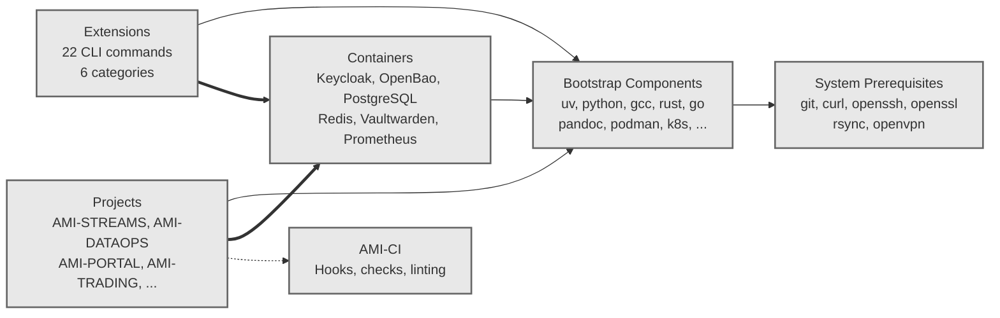
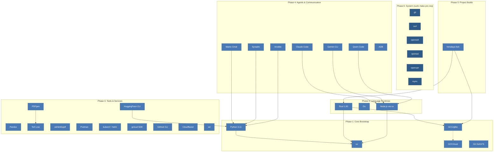
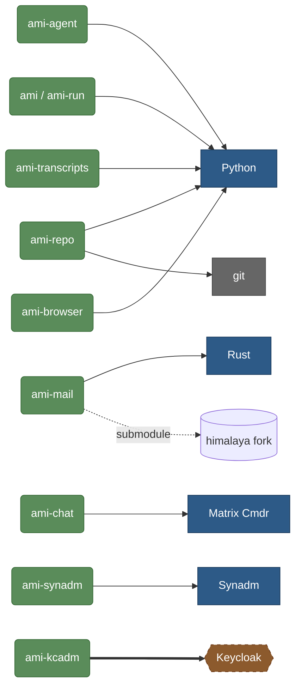
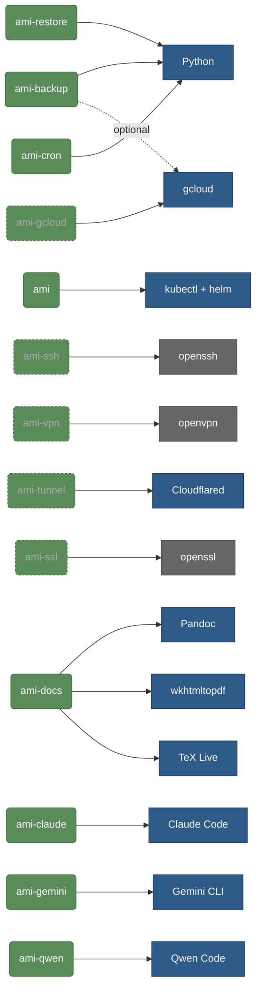
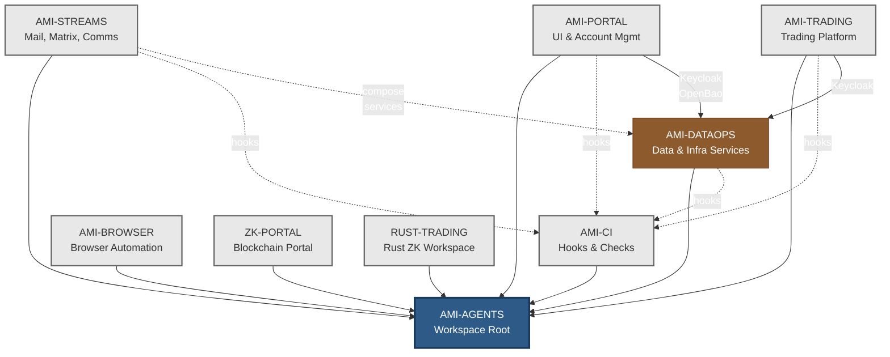
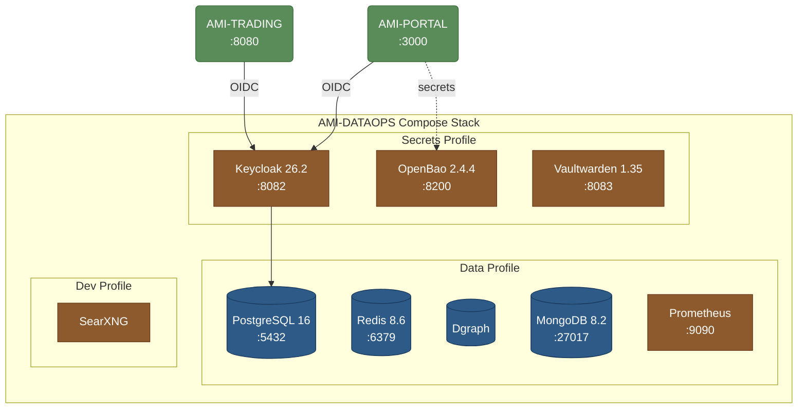

# AMI Dependency Map

**Date:** 2026-04-14
**Type:** Architecture Reference

---

## 1. Overview — Category Relationships

High-level view: how the major groups depend on each other.

---

## 2. Bootstrap Install Chain

What installs what, in order. Arrows mean "depends on".

---

## 3. Extensions → Bootstrap Dependencies

Each extension (left) and what bootstrap component it needs (right).

### Core & Enterprise Extensions

### Dev, Docs & Agent Extensions

---

## 4. Project Topology

How AMI projects depend on each other.

---

## 5. Container Service Map

Services deployed via AMI-DATAOPS compose stack.

---

## Summary Table

| Extension | Category | Bootstrap Deps | Dep Type | Project |
|-----------|----------|---------------|----------|---------|
| ami-agent | core | python | binary | AGENTS |
| ami / ami-run | core | python, kubectl, helm | binary | AGENTS |
| ami-repo | core | python, git | binary, system | AGENTS |
| ami-transcripts | core | python | binary | AGENTS |
| ami-mail | enterprise | rust, gcc-glibc | binary + submodule | STREAMS |
| ami-chat | enterprise | matrix-commander | binary | STREAMS |
| ami-synadm | enterprise | synadm | binary | STREAMS |
| ami-kcadm | enterprise | keycloak container | container | DATAOPS |
| ami-browser | enterprise | python (playwright) | binary | AGENTS |
| ami-backup | dev | python, gcloud (opt) | binary | DATAOPS |
| ami-restore | dev | python | binary | DATAOPS |
| ami-gcloud | dev (hidden) | gcloud SDK | binary | AGENTS |
| ami-cron | dev | python | binary | AGENTS |
| ami-ssh | infra (hidden) | openssh | system | AGENTS |
| ami-vpn | infra (hidden) | openvpn | system | AGENTS |
| ami-tunnel | infra (hidden) | cloudflared | binary | AGENTS |
| ami-ssl | infra (hidden) | openssl | system | AGENTS |
| ami-docs | docs | pandoc, wkhtmltopdf, texlive | binary | AGENTS |
| ami-claude | agents | claude code (node) | binary | AGENTS |
| ami-gemini | agents | gemini cli (node) | binary | AGENTS |
| ami-qwen | agents | qwen code (node) | binary | AGENTS |
