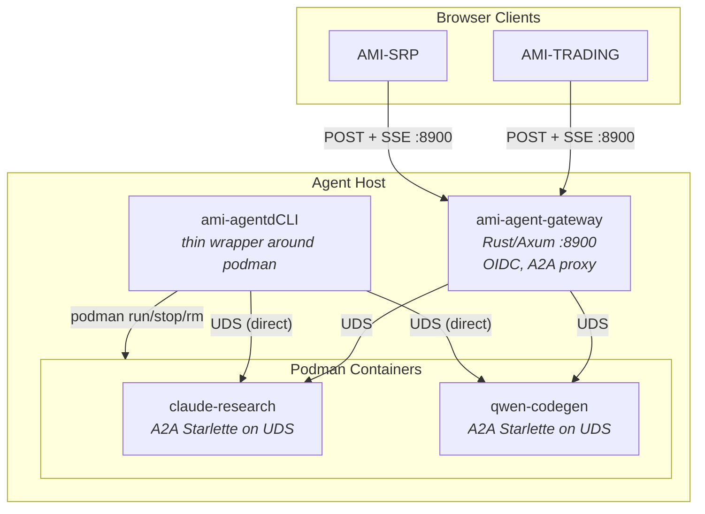

# REQUIREMENTS: Containerised Agent Isolation

## Purpose

Run AI coding agents (Claude, Qwen, Gemini) in isolated Podman containers with controlled filesystem access, network whitelisting, and A2A protocol communication. Lean on Podman's native features: labels for metadata, volumes for persistence, network policies for isolation. Minimal custom code.

## Naming Convention

| Binary | Role | Where it runs |
|--------|------|---------------|
| `ami-agent` | The agent itself (BootloaderAgent, ReAct loop, CLI providers) | Host AND containers |
| `ami-agentd` | Container manager + A2A gateway. Single Rust binary, two modes. | **Host only** (disabled inside containers) |

`ami-agentd` is a **single Rust (Axum) binary** that serves as both the CLI and the gateway:
- `ami-agentd create/start/stop/list/sync/...`: CLI commands (run podman, exit)
- `ami-agentd serve`: starts the A2A gateway server (long-running, port `:8900`)

Registered in `extensions.yaml` as an alias to `.boot-linux/bin/ami-agentd` (the compiled Rust binary).

Inside containers, `ami-agentd` MUST exit with: `"ami-agentd is not available inside containers"`. Detection: `AMI_CONTAINER=1` env var (set in Dockerfile).

This mirrors the `podman` model, serving as both a CLI tool and a service (`podman system service`).

## Principles

1. **Podman-native**: use labels, volumes, networks, health checks, inspect; don't reimplement what Podman already does
2. **Thin CLI wrapper**: `ami-agentd` generates `podman run` commands from simple flags, nothing more
3. **Dockerfile template**: one parameterised Dockerfile, build args for provider/tools
4. **A2A server inside container**: ~100 LOC Python wrapping BootloaderAgent
5. **Gateway for remote access**: Rust/Axum reverse proxy, only needed when browser/remote services need to reach agents

---

## Architecture



---

## 1. Container Image

### FR-1.1: Parameterised Dockerfile

Single `Dockerfile.agent` at AMI-AGENTS repo root:

```dockerfile
FROM python:3.11.14-slim-bookworm

ARG PROVIDER=claude
ARG INSTALL_CONFIG=ami/config/install-defaults.yaml
ARG AGENT_UID=1000

# System deps
RUN apt-get update && apt-get install -y --no-install-recommends \
    git curl rsync iptables gosu ca-certificates gnupg && \
    curl -fsSL https://deb.nodesource.com/gpgkey/nodesource-repo.gpg.key | \
    gpg --dearmor -o /etc/apt/keyrings/nodesource.gpg && \
    echo "deb [signed-by=/etc/apt/keyrings/nodesource.gpg] https://deb.nodesource.com/node_20.x nodistro main" \
    > /etc/apt/sources.list.d/nodesource.list && \
    apt-get update && apt-get install -y nodejs && \
    rm -rf /var/lib/apt/lists/*

# Non-root user
RUN groupadd -g ${AGENT_UID} agent && useradd -u ${AGENT_UID} -g agent -m agent

# AMI-AGENTS source + install
COPY . /opt/ami-agents
WORKDIR /opt/ami-agents
COPY ${INSTALL_CONFIG} /tmp/install-config.yaml
RUN make install-ci INSTALL_DEFAULTS=/tmp/install-config.yaml && \
    make register-extensions

# A2A server entrypoint
COPY res/docker/agent-entrypoint.sh /entrypoint.sh

ENV AMI_CONTAINER=1
LABEL ami.type="agent"
HEALTHCHECK --interval=30s CMD test -S /run/a2a/agent.sock

ENTRYPOINT ["/entrypoint.sh"]
```

**Acceptance criteria**: `podman build -f Dockerfile.agent --build-arg PROVIDER=claude -t ami-agent:claude .` succeeds.

### FR-1.2: Entrypoint (gosu privilege drop)

```bash
#!/bin/bash
# 1. Apply iptables whitelist (runs as root)
iptables -P OUTPUT DROP
iptables -A OUTPUT -o lo -j ACCEPT
iptables -A OUTPUT -m state --state ESTABLISHED,RELATED -j ACCEPT
# Whitelist from labels (injected by ami-agentdCLI)
for rule in $AMI_NETWORK_WHITELIST; do
    IFS=: read -r ip port <<< "$rule"
    iptables -A OUTPUT -p tcp -d "$ip" --dport "$port" -j ACCEPT
done

# 2. Drop to agent user, start A2A server
exec gosu agent python -m ami_agent_a2a --sock /run/a2a/agent.sock
```

**Acceptance criteria**: `ps` inside container shows no root processes after init. A2A socket exists.

---

## 2. Agent Metadata via Podman Labels

No custom registry. No `agent.json`. No `~/.ami/agents/`. Podman IS the registry.

```bash
podman run -d \
  --name claude-research \
  --label ami.type=agent \
  --label ami.provider=claude \
  --label ami.model=claude-sonnet-4-5 \
  --label ami.network=whitelist \
  --label ami.created="$(date -Iseconds)" \
  --label ami.scope.observe=allow \
  --label ami.scope.modify=deny \
  --label ami.scope.execute=deny \
  --label ami.scope.admin=deny \
  ...
```

Query metadata:
```bash
# List all agents
podman ps -a --filter label=ami.type=agent \
  --format "table {{.Names}} {{.Status}} {{.Label \"ami.provider\"}} {{.Label \"ami.model\"}}"

# Inspect one agent
podman inspect claude-research --format '{{json .Config.Labels}}'
```

**Acceptance criteria**: `podman ps --filter label=ami.type=agent` lists all agents with their metadata. No external files needed.

---

## 3. Persistence via Named Volumes

```bash
podman volume create claude-research-workspace
podman volume create claude-research-transcripts
podman volume create claude-research-cache

podman run -d \
  --name claude-research \
  -v claude-research-workspace:/workspace \
  -v claude-research-transcripts:/transcripts \
  -v claude-research-cache:/cache \
  ...
```

- **workspace**: project files (rsync'd on demand, not live-mounted)
- **transcripts**: TranscriptStore JSONL (conversation history)
- **cache**: .boot-linux, .venv, node_modules (expensive to rebuild)

Volumes survive `podman stop/start/restart`. Destroyed only with `podman rm -v` or `podman volume rm`.

**Acceptance criteria**: `podman stop claude-research && podman start claude-research` preserves all data. `podman volume ls --filter label=ami.agent=claude-research` lists volumes.

---

## 4. Credentials via Read-Only Bind Mounts

```bash
podman run -d \
  -v ~/.claude:/home/agent/.claude:ro \
  -v ~/.config/qwen:/home/agent/.config/qwen:ro \
  ...
```

`:ro` = read-only. Agent cannot modify credentials. Host credential changes visible immediately (bind mount, not rsync).

For credential rotation: agent CLI subprocess re-reads credentials from disk on each invocation. No restart needed.

**Acceptance criteria**: Agent can read API keys. Agent cannot modify credential files. Key rotation on host takes effect on next agent CLI invocation.

---

## 5. Network Isolation

### FR-5.1: Default-Deny via Entrypoint iptables

The entrypoint script (running as root before gosu) applies iptables rules. Whitelist entries passed via environment variable:

```bash
podman run -d \
  --cap-add=NET_ADMIN \
  -e AMI_NETWORK_WHITELIST="api.anthropic.com:443 github.com:443 pypi.org:443 registry.npmjs.org:443" \
  ...
```

Auto-whitelist: `ami-agentdcreate` generates the whitelist based on provider (Anthropic API for Claude, Google API for Gemini) + standard package registries.

### FR-5.2: Inter-Agent Communication via Shared UDS Directory

Agents on the mesh share a host directory for UDS sockets:

```bash
# Mesh agent
podman run -d \
  -v /tmp/ami-agentd-mesh:/mesh \
  --label ami.mesh=true \
  ...

# Non-mesh agent (no /mesh mount = no access)
podman run -d ...
```

### FR-5.3: Network Modes

| Mode | iptables | Whitelist |
|------|----------|-----------|
| `whitelist` (default) | DROP default + explicit ACCEPT | Provider API + package registries |
| `allow-all` | No rules | Everything allowed |
| `deny-all` | DROP all + loopback only | Nothing, fully offline |

**Acceptance criteria**: `curl google.com` fails in whitelist/deny-all modes. Provider API works in whitelist mode.

---

## 6. ami-agentdCLI (Thin Podman Wrapper)

Every command translates to one or more `podman` commands. No custom state management.

```bash
ami-agentdcreate {name} --provider {p}     # podman build (if needed) + podman run
ami-agentdlist                              # podman ps --filter label=ami.type=agent
ami-agentdstart {name}                      # podman start {name}
ami-agentdstop {name}                       # podman stop {name}
ami-agentdrestart {name}                    # podman restart {name}
ami-agentddestroy {name}                    # podman rm -v {name} (with confirmation)
ami-agentdshell {name}                      # podman exec -it -u agent {name} /bin/bash
ami-agentdroot-shell {name}                 # podman exec -it -u root {name} /bin/bash
ami-agentdlogs {name}                       # podman logs -f {name}
ami-agentdstatus {name}                     # podman inspect + podman stats --no-stream
ami-agentdsync {name} [--path P]            # rsync host → container volume
ami-agentddiscover                          # podman ps --filter + read agent cards
ami-agentdsend {name} "message"             # A2A SendMessage via UDS
```

`ami-agentdcreate` is the only "smart" command. It:
1. Builds image if not cached (`podman build --build-arg PROVIDER=...`)
2. Creates named volumes (`podman volume create`)
3. Generates the `podman run` command with all labels, volumes, mounts, env vars
4. Starts the container
5. Waits for health check (UDS socket exists)

**Acceptance criteria**: Every `ami-agentd` command maps to documented `podman` commands. No hidden state files. `podman` commands work independently of `ami-agentd`.

---

## 7. Workspace Sync (rsync on demand)

NOT live-mounted. NOT a daemon. Manual rsync when needed:

```bash
ami-agentdsync claude-research                          # full workspace sync
ami-agentdsync claude-research --path src/core/         # partial sync
ami-agentdsync claude-research --direction pull          # container → host
ami-agentdsync claude-research --dry-run                 # preview only
```

Translates to:
```bash
rsync -av --partial --exclude='.git' --exclude='node_modules' --exclude='.venv' \
  /home/ami/AMI-AGENTS/ \
  $(podman volume inspect claude-research-workspace --format '{{.Mountpoint}}')/
```

No sync daemon. No inotifywait. No change detection. User syncs when they want to.

**Acceptance criteria**: `ami-agentdsync X` copies files. `--dry-run` shows what would change. `--path` syncs a subset.

---

## 8. Security

### FR-8.1: Container Security Flags

```bash
podman run \
  --userns=keep-id \
  --cap-drop=ALL \
  --cap-add=NET_ADMIN \
  --security-opt=no-new-privileges \
  --read-only \
  --tmpfs /tmp:rw,noexec,nosuid \
  --tmpfs /run:rw,noexec,nosuid \
  --memory=4g --cpus=2 --pids-limit=256 \
  ...
```

### FR-8.2: Read-Only Root Filesystem

Writable areas: `/workspace`, `/transcripts`, `/cache`, `/tmp`, `/run`, `/home/agent`. Everything else read-only.

### FR-8.3: Agent Security Profile

Inside the container, BootloaderAgent runs with:
- `ScopeOverride(observe="allow", modify="deny", execute="deny", admin="deny", execute_allow=["\\bami-browser\\b"])`
- `allowed_tools=["Read", "WebSearch", "WebFetch"]` (Claude) / `["read_file", "web_search", "web_fetch"]` (Qwen)
- `enable_hooks=True`

See `REQUIREMENTS-CHAT-AGENT-PROFILE.md` for full details.

---

## 9. A2A Server Inside Container

~100 lines of Python wrapping BootloaderAgent for A2A protocol:

```python
# ami_agent_a2a/__main__.py
from a2a.server.apps import A2AStarletteApplication
from a2a.server.request_handlers import DefaultRequestHandler
from a2a.server.tasks import InMemoryTaskStore

class AMIAgentExecutor(AgentExecutor):
    async def execute(self, context, event_queue):
        def run():
            ctx = RunContext(
                instruction=extract_text(context),
                stream_callback=lambda chunk: queue.put_nowait(chunk),
                scope_overrides=CHAT_SCOPE,
            )
            return agent.run(ctx)
        await asyncio.to_thread(run)

server = A2AStarletteApplication(agent_card=card, http_handler=handler)
uvicorn.run(server.build(), uds=sys.argv[2])  # binds to UDS
```

Publishes Agent Card, handles SendMessage/SendStreamingMessage, streams via SSE over UDS.

**Acceptance criteria**: Gateway can send A2A message to agent UDS. Agent streams response back.

---

## 10. Gateway (`ami-agentd serve`)

Started via `ami-agentd serve`. Same Rust binary as the CLI, just a different subcommand that runs long.

- Single port `:8900`, TLS termination
- Multi-issuer OIDC JWT validation
- A2A-aware: validates messages (types generated from A2A v0.3 OpenAPI schema), structured logging
- Routes `/agents/{name}/*` → agent's UDS
- Interaction log persistence: **SQLite by default** (`~/.ami/agentd.db`), PostgreSQL optional via `DATABASE_URL` env var
- Session management: proxies A2A `ListTasks`/`GetTask` to agents
- CORS headers for browser origins
- Rate limiting: 60 req/min per user
- `GET /health`: unauthenticated, returns agent count + health status

**Agent health monitoring (both layers)**:
1. **Podman HEALTHCHECK**: already in Dockerfile, checks UDS socket exists. Gateway reads via `podman inspect --format '{{.State.Health.Status}}'`
2. **A2A probe**: gateway periodically sends a lightweight request to each agent's UDS. If no response within 5s, marks agent as unhealthy in `/health` response.

See `REQUIREMENTS-CHAT-BACKEND.md` for full gateway specification.

---

## 11. Agent Upgrades (In-Place)

```bash
ami-agentdshell claude-research
# inside:
npm update @anthropic-ai/claude-code
```

No image rebuild. Volumes preserved. Image drifts from Dockerfile, which is acceptable for dev. For prod, rebuild: `ami-agentdcreate claude-research --provider claude --rebuild`.

---

## 12. Monitoring

```bash
ami-agentdstatus claude-research    # podman inspect + podman stats
ami-agentdlogs claude-research      # podman logs
ami-agentdlogs claude-research -f   # podman logs -f
```

Container logs go to Podman's default log driver (journald). No external monitoring stack.

---

## Resolved Decisions

| # | Decision | Choice |
|---|----------|--------|
| 1 | Registry | **Podman labels**, no custom filesystem registry |
| 2 | Credentials | **Bind mount :ro**, not rsync |
| 3 | Workspace sync | **rsync on demand**, no daemon, no inotifywait |
| 4 | DNS filtering | **iptables only**, dnsmasq optional for hardened mode |
| 5 | Inter-agent | **Shared UDS directory**, mount = access |
| 6 | Remote access | **Gateway (Rust/Axum)**, OIDC, A2A-aware, single port |
| 7 | Entrypoint | **gosu**, privilege drop after iptables |
| 8 | Upgrades | **In-place**, npm update inside container |
| 9 | Monitoring | **podman logs/stats**, journald, no external stack |
| 10 | Metadata | **Podman labels**, queryable via podman inspect/ps |
| 11 | Chat protocol | **POST + SSE**, A2A native, no WebSocket |
| 12 | Gateway auth | **Multi-issuer OIDC** |

## Open Questions

1. Should `ami-agentdcreate` auto-detect which provider credentials exist on the host and only mount relevant ones?
2. How to handle agent-to-agent task delegation over the mesh? Direct A2A via shared UDS, or via CLI as intermediary?
3. A2A spec version: pin to v0.3 or track latest?
