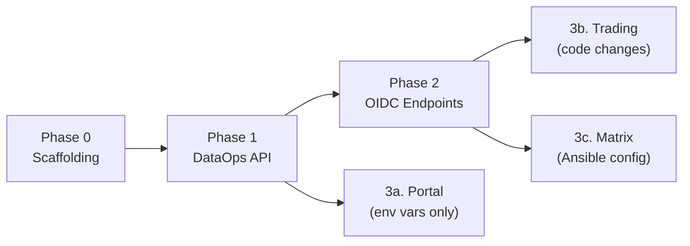
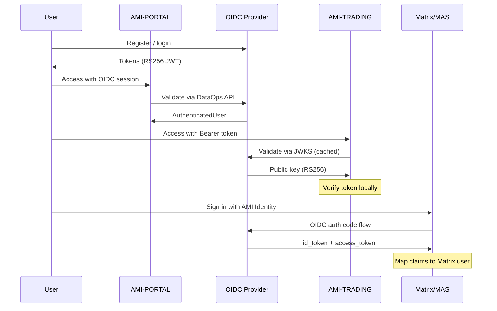

# Specification: Consumer Migration to OIDC Provider

**Document Version:** 1.0
**Classification:** Technical Specification
**Domain:** Authentication & Identity -- Migration
**Last Updated:** February 2026
**Prerequisite Reading:** [SPEC-AUTH-OIDC-PROVIDER.md](SPEC-AUTH-OIDC-PROVIDER.md)

---

## Table of Contents

1. [Overview](#1-overview)
2. [Migration Order](#2-migration-order)
3. [AMI-PORTAL Migration](#3-ami-portal-migration)
4. [AMI-TRADING Migration](#4-ami-trading-migration)
5. [Matrix/MAS Migration](#5-matrixmas-migration)
6. [Rollback Strategy](#6-rollback-strategy)
7. [Testing Strategy](#7-testing-strategy)

---

## 1. Overview

Once the OIDC provider (SPEC-AUTH-OIDC-PROVIDER Phase 1 + Phase 2) is operational, each consuming service must be migrated from its current auth mechanism to the centralized OIDC provider. This document specifies the migration for each consumer.

### 1.1. Current State

| Consumer | Current Auth | Token Format | User Store |
|---|---|---|---|
| AMI-PORTAL | NextAuth.js via `@ami/auth` TS library | Session cookie (NextAuth) | Local JSON / DataOps API |
| AMI-TRADING | Custom FastAPI JWT auth | HS256 JWT + httpOnly cookie | PostgreSQL (local users table) |
| Matrix/MAS | Matrix Authentication Service | MAS OAuth2 tokens | MAS internal store |

### 1.2. Target State

| Consumer | Target Auth | Token Format | User Store |
|---|---|---|---|
| AMI-PORTAL | OIDC via wellKnown discovery | RS256 JWT (from OIDC provider) | OIDC provider `/auth/users/*` |
| AMI-TRADING | OIDC token validation via JWKS | RS256 JWT (from OIDC provider) | OIDC provider (via token claims) |
| Matrix/MAS | Upstream OIDC delegation | RS256 JWT (from OIDC provider) | OIDC provider (via userinfo) |

---

## 2. Migration Order



**SPEC-MIG-001**: AMI-PORTAL shall be migrated first because it requires zero code changes (environment variables only) and validates the DataOps API contract.

**SPEC-MIG-002**: AMI-TRADING and Matrix/MAS migrations require OIDC endpoints (Phase 2) and can proceed in parallel after Phase 2 is complete.

---

## 3. AMI-PORTAL Migration

### 3.1. Scope

AMI-PORTAL uses the `@ami/auth` TypeScript library which calls the DataOps API via `DataOpsClient` in `projects/AMI-AUTH/src/dataops-client.ts`. The migration involves:

1. Pointing the DataOps client at the new Python service
2. Adding the OIDC provider to the provider catalog

**No TypeScript code changes required.**

### 3.2. Environment Configuration

Set the following environment variables in AMI-PORTAL's deployment:

```bash
# Point DataOps client at the Python OIDC service
DATAOPS_AUTH_URL=http://ami-auth:8000

# Shared secret for internal API authentication
DATAOPS_INTERNAL_TOKEN=<generated-secret>
```

These variables are read by `projects/AMI-AUTH/src/env.ts` and used by `DataOpsClient` constructor at `dataops-client.ts:158-164`.

### 3.3. Provider Catalog Entry

The OIDC provider registers itself in the provider catalog endpoint (`GET /auth/providers/catalog`). When Portal fetches the catalog, it receives:

```json
[
  {
    "id": "ami-oidc",
    "providerType": "oauth2",
    "mode": "oauth",
    "clientId": "ami-portal",
    "clientSecret": "<portal-client-secret>",
    "wellKnown": "https://auth.example.com/.well-known/openid-configuration",
    "flags": {
      "allowDangerousEmailAccountLinking": true
    }
  }
]
```

The TypeScript config system at `projects/AMI-AUTH/src/config.ts:233-235` already handles `wellKnown`:

```typescript
if (entry.wellKnown) {
    baseOptions.wellKnown = entry.wellKnown
}
```

And `providerType: "oauth2"` maps to a generic OAuth provider at `config.ts:244-255`, which reads `sub`, `email`, `name`, `picture` from the OIDC userinfo response.

### 3.4. Client Registration

Register `ami-portal` as an OIDC client in the provider's `oauth_clients` table:

| Field | Value |
|---|---|
| `id` | `ami-portal` |
| `client_secret_hash` | bcrypt hash of client secret |
| `client_name` | AMI Portal |
| `redirect_uris` | `["https://portal.example.com/api/auth/callback/ami-oidc"]` |
| `grant_types` | `["authorization_code", "refresh_token"]` |
| `scope` | `openid profile email roles` |
| `token_endpoint_auth_method` | `client_secret_post` |

### 3.5. Verification

1. Start the OIDC service and Portal locally
2. Verify `DataOpsClient.verifyCredentials()` returns valid `AuthenticatedUser` objects
3. Verify `DataOpsClient.getUserByEmail()` and `getUserById()` work
4. Verify `DataOpsClient.getAuthProviderCatalog()` returns the OIDC entry
5. Verify NextAuth login flow works via the `ami-oidc` provider
6. Verify existing local-store fallback still works when `DATAOPS_AUTH_URL` is unset

---

## 4. AMI-TRADING Migration

### 4.1. Scope

AMI-TRADING currently implements its own JWT authentication:

| File | Current Function | Lines |
|---|---|---|
| `src/core/security.py` | `decode_token(token, secret)` | HS256 verification with shared secret |
| `src/delivery/api/deps.py` | `get_current_user()` | Extract JWT from Bearer/cookie, validate, return `UserPayload` |
| `src/delivery/api/deps.py` | `RateLimiter` | Sliding window rate limiting |

The migration replaces HS256 local verification with RS256 JWKS-based verification.

### 4.2. Changes to `src/core/security.py`

**Current** (`decode_token`):
```python
def decode_token(token: str, secret: str) -> dict:
    return jwt.decode(token, secret, algorithms=["HS256"])
```

**Target** (`decode_oidc_token`):
```python
import httpx
from functools import lru_cache
from datetime import datetime, UTC

JWKS_CACHE_TTL = 3600  # seconds

@lru_cache(maxsize=1)
def _fetch_jwks(jwks_uri: str, _cache_buster: int = 0) -> dict:
    """Fetch JWKS from the OIDC provider. Cached for 1 hour."""
    response = httpx.get(jwks_uri, timeout=10)
    response.raise_for_status()
    return response.json()

def get_jwks(jwks_uri: str, force_refresh: bool = False) -> dict:
    cache_buster = 0 if not force_refresh else int(
        datetime.now(UTC).timestamp()
    )
    return _fetch_jwks(jwks_uri, cache_buster)

def decode_oidc_token(
    token: str,
    jwks_uri: str,
    issuer: str,
    audience: str,
) -> dict:
    """Decode and verify an RS256 JWT using JWKS."""
    jwks = get_jwks(jwks_uri)
    header = jwt.get_unverified_header(token)
    kid = header.get("kid")

    # Find matching key
    key_data = None
    for key in jwks.get("keys", []):
        if key.get("kid") == kid:
            key_data = key
            break

    if not key_data:
        # Key not found -- try refreshing JWKS (key rotation)
        jwks = get_jwks(jwks_uri, force_refresh=True)
        for key in jwks.get("keys", []):
            if key.get("kid") == kid:
                key_data = key
                break

    if not key_data:
        msg = f"No matching key for kid={kid}"
        raise jwt.InvalidTokenError(msg)

    public_key = jwt.algorithms.RSAAlgorithm.from_jwk(key_data)
    return jwt.decode(
        token,
        public_key,
        algorithms=["RS256"],
        issuer=issuer,
        audience=audience,
    )
```

**SPEC-MIG-003**: The JWKS shall be cached with a TTL of 3600 seconds. On `kid` mismatch, the cache shall be refreshed exactly once before raising `InvalidTokenError`.

> **Note:** `httpx.get()` is intentionally synchronous because `lru_cache` requires a synchronous callable. Blocking occurs only on cache miss (~once per hour). For high-throughput paths, wrap in `asyncio.to_thread()`.

### 4.3. Changes to `src/delivery/api/deps.py`

**Current** `get_current_user()` at lines 129-178:

```python
# Current: HS256 with local secret
config = get_config()
payload = decode_token(token, config.jwt_secret)
user_id = payload.get("sub")
```

**Target:**

```python
# Target: RS256 with OIDC JWKS
config = get_config()
payload = decode_oidc_token(
    token,
    jwks_uri=config.oidc_jwks_uri,
    issuer=config.oidc_issuer,
    audience=config.oidc_audience,
)
user_id = payload.get("sub")
```

### 4.4. Configuration Changes

Add to AMI-TRADING's settings/config:

```python
# OIDC provider settings
oidc_issuer: str = "https://auth.example.com"
oidc_jwks_uri: str = "https://auth.example.com/oauth/jwks"
oidc_audience: str = "ami-trading"
```

Remove after grace period (see SPEC-MIG-004):
```python
jwt_secret: str  # Retained during transition, remove after grace period
```

**SPEC-MIG-004**: The `jwt_secret` configuration shall be retained during transition for backward compatibility with existing sessions. After a grace period (configurable, default 7 days), it shall be removed.

### 4.5. Login Flow Change

Currently AMI-TRADING handles login and registration directly:
- `POST /api/v1/auth/login` -- accepts email+password, issues HS256 JWT
- `POST /api/v1/auth/register` -- creates user, issues HS256 JWT

**Target**: These endpoints redirect to the OIDC provider's authorization flow:

1. Client calls `GET /api/v1/auth/login`
2. Trading backend redirects to `https://auth.example.com/oauth/authorize?client_id=ami-trading&...`
3. User authenticates at the OIDC provider
4. Provider redirects back to `https://trading.example.com/api/v1/auth/callback?code=...`
5. Trading backend exchanges the code for tokens at `POST /oauth/token`
6. Trading backend sets the access token as an httpOnly cookie

**SPEC-MIG-005**: The existing `RateLimiter` in `deps.py` shall remain unchanged. It protects AMI-TRADING's own endpoints, not the auth service.

### 4.6. Client Registration

Register `ami-trading` as an OIDC client:

| Field | Value |
|---|---|
| `id` | `ami-trading` |
| `client_secret_hash` | bcrypt hash of client secret |
| `client_name` | AMI Trading Platform |
| `redirect_uris` | `["https://trading.example.com/api/v1/auth/callback"]` |
| `grant_types` | `["authorization_code", "refresh_token", "client_credentials"]` |
| `scope` | `openid profile email roles` |

### 4.7. Verification

1. Verify `decode_oidc_token()` correctly validates RS256 JWTs from the OIDC provider
2. Verify `get_current_user()` works with OIDC-issued tokens
3. Verify JWKS caching: first call fetches, subsequent calls use cache
4. Verify kid rotation: on `kid` mismatch, JWKS is refreshed
5. Verify login redirect flow works end-to-end
6. Verify existing httpOnly cookie mechanism still works with new tokens
7. Verify rate limiters unaffected

---

## 5. Matrix/MAS Migration

### 5.1. Scope

Matrix Synapse uses the Matrix Authentication Service (MAS) deployed via Ansible at `projects/AMI-STREAMS/ansible/matrix-docker-ansible-deploy/`. MAS already supports upstream OIDC providers. The migration adds AMI-AUTH as an upstream provider.

### 5.2. MAS Configuration

The MAS Ansible role supports `upstream_oauth2.providers` configuration. Add the AMI-AUTH OIDC provider:

```yaml
matrix_authentication_service_config_upstream_oauth2_providers:
  - id: ami-auth
    human_name: "AMI Identity"
    issuer: "https://auth.example.com/"
    client_id: "matrix-synapse"
    client_secret: "{{ vault_mas_ami_auth_client_secret }}"
    scope: "openid profile email"
    token_endpoint_auth_method: "client_secret_post"
    claims_imports:
      localpart:
        action: require
        template: "{{ '{{' }} user.email.localpart {{ '}}' }}"
      displayname:
        action: suggest
        template: "{{ '{{' }} user.name {{ '}}' }}"
      email:
        action: force
        template: "{{ '{{' }} user.email {{ '}}' }}"
```

### 5.3. Client Registration

Register `matrix-synapse` as an OIDC client:

| Field | Value |
|---|---|
| `id` | `matrix-synapse` |
| `client_secret_hash` | bcrypt hash of client secret |
| `client_name` | Matrix Synapse |
| `redirect_uris` | `["https://matrix.example.com/upstream/callback/<provider-id>"]` |
| `grant_types` | `["authorization_code", "refresh_token"]` |
| `scope` | `openid profile email` |

**SPEC-MIG-006**: The MAS redirect URI format is determined by the MAS deployment. The exact callback path must be confirmed from the MAS documentation or runtime logs during testing.

### 5.4. Claims Mapping

MAS maps OIDC claims to Matrix user attributes:

| OIDC Claim | Matrix Attribute | MAS Action |
|---|---|---|
| `email` (localpart) | `@localpart:matrix.example.com` | `require` (must be present) |
| `name` | Display name | `suggest` (user can override) |
| `email` | Email (verified) | `force` (always set from OIDC) |

The OIDC provider's `/oauth/userinfo` endpoint returns these claims as specified in SPEC-AUTH-OIDC-PROVIDER Section 5.4.

### 5.5. Coexistence with Password Auth

**SPEC-MIG-007**: MAS shall continue to support its existing password authentication alongside the new OIDC upstream provider. Users can choose to log in via AMI Identity (OIDC) or via their existing Matrix password. This is the default MAS behavior when both password and upstream providers are configured.

### 5.6. Verification

1. Run the Ansible playbook to apply the MAS configuration
2. Verify MAS can reach `/.well-known/openid-configuration` on the OIDC provider
3. Verify the Element Web login page shows "Sign in with AMI Identity" button
4. Complete a full login flow: Element -> MAS -> OIDC provider -> login -> callback -> Matrix session
5. Verify the Matrix user's display name and email match OIDC claims
6. Verify existing password logins still work

---

## 6. Rollback Strategy

### 6.1. AMI-PORTAL Rollback

Remove `DATAOPS_AUTH_URL` environment variable. The `DataOpsClient` at `dataops-client.ts:179-195` falls back to local store when `this.baseUrl` is null:

```typescript
if (this.baseUrl) {
    try { return await requestJSON<...>(...) }
    catch (err) { /* log, fall through */ }
}
if (this.localStore) {
    return this.localStore.verifyCredentials(payload)
}
```

**Rollback time**: Immediate (env var change + restart).

### 6.2. AMI-TRADING Rollback

Revert `src/core/security.py` to use `decode_token()` with HS256. Revert `deps.py` to use `config.jwt_secret`. Restore `jwt_secret` in config.

**SPEC-MIG-008**: During the transition period (default 7 days), AMI-TRADING shall support both HS256 and RS256 tokens. The `get_current_user()` function shall attempt RS256 first, fall back to HS256:

```python
try:
    payload = decode_oidc_token(token, ...)
except jwt.InvalidTokenError:
    payload = decode_token(token, config.jwt_secret)
```

This dual-mode validation shall be removed after the grace period.

**Rollback time**: Code revert + redeploy.

### 6.3. Matrix/MAS Rollback

Remove the `ami-auth` entry from `upstream_oauth2_providers` in the Ansible vars. Re-run the playbook. MAS reverts to password-only authentication.

**Rollback time**: Ansible playbook run (~5 minutes).

---

## 7. Testing Strategy

### 7.1. Per-Consumer Tests

| Consumer | Test Type | Description |
|---|---|---|
| Portal | Contract test | Verify `DataOpsClient` methods against running Python service |
| Portal | E2E test | NextAuth login via OIDC provider in dev environment |
| Trading | Unit test | `decode_oidc_token()` with mock JWKS |
| Trading | Unit test | `get_current_user()` with RS256 token |
| Trading | Integration test | Full login redirect flow against running OIDC provider |
| Trading | Regression test | Verify HS256 fallback during transition period |
| Matrix | Smoke test | MAS can fetch discovery document |
| Matrix | E2E test | Full Element login via OIDC provider |

### 7.2. Cross-Service Integration Test

Validate that a single user identity works across all services:



**SPEC-MIG-009**: The cross-service integration test shall verify that the same `sub` (user ID) appears in all three services after login, confirming unified identity.

### 7.3. Migration Acceptance Criteria

| # | Criterion | Validation Method |
|---|---|---|
| 1 | Portal DataOps API calls succeed against Python service | Contract test |
| 2 | Portal OIDC login works via wellKnown discovery | E2E test |
| 3 | Trading validates RS256 JWTs from OIDC provider | Unit + integration test |
| 4 | Trading JWKS caching and kid rotation works | Unit test |
| 5 | Matrix MAS shows OIDC login option | Manual verification |
| 6 | Matrix login creates user with correct claims | E2E test |
| 7 | Same user ID (`sub`) appears in all three services | Cross-service test |
| 8 | Rollback to local auth works for each consumer | Manual verification |
| 9 | No increase in login latency > 200ms (p95) | Load test |
