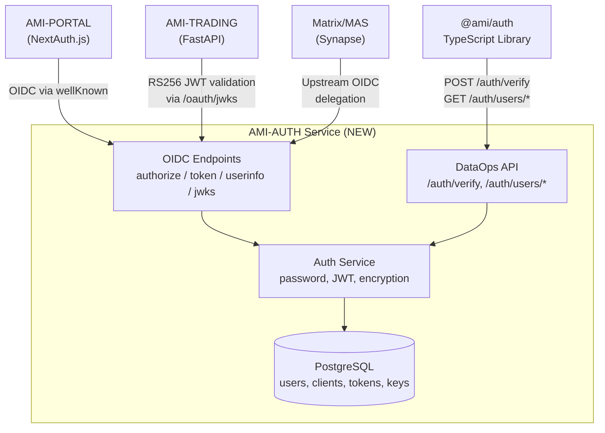
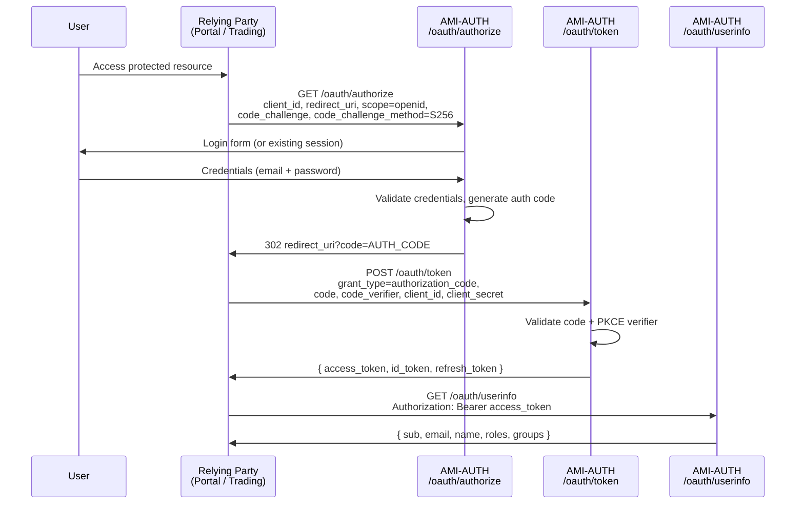
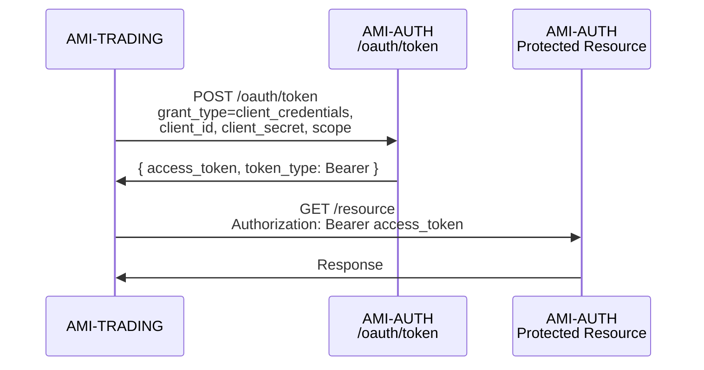

# Specification: AMI Unified OIDC Identity Provider

**Date:** 2026-02-01
**Status:** DRAFT
**Type:** Specification
**Domain:** Authentication & Identity
**Prerequisite:** [AUTH-FRAGMENTATION-AUDIT.md](archive/AUTH-FRAGMENTATION-AUDIT.md)

---

## Table of Contents

1. [Executive Summary](#1-executive-summary)
2. [Problem Statement](#2-problem-statement)
3. [Solution Overview](#3-solution-overview)
4. [Architecture](#4-architecture)
5. [OIDC Endpoints](#5-oidc-endpoints)
6. [DataOps Compatibility API](#6-dataops-compatibility-api)
7. [Database Schema](#7-database-schema)
8. [Authlib Integration](#8-authlib-integration)
9. [Project Structure](#9-project-structure)
10. [Dependencies](#10-dependencies)
11. [Security](#11-security)
12. [Implementation Phases](#12-implementation-phases)
13. [Verification](#13-verification)

---

## 1. Executive Summary

This specification defines a standards-compliant **OpenID Connect (OIDC) Identity Provider** to be built as a Python FastAPI service inside the existing `projects/AMI-AUTH/` project. The service consolidates 6 fragmented authentication systems into a single identity plane. All AMI services become OIDC relying parties, using RS256-signed JWTs from a shared issuer.

The existing TypeScript NextAuth.js client library in `projects/AMI-AUTH/src/` remains unchanged. The Python service is added alongside it, making AMI-AUTH a polyglot project: TypeScript client library + Python OIDC server.

---

## 2. Problem Statement

The AUTH-FRAGMENTATION-AUDIT (February 2026) identified:

| # | System | Location | Technology | Status |
|---|--------|----------|------------|--------|
| 1 | AMI-AUTH | `projects/AMI-AUTH/` | TypeScript, NextAuth.js v5 | Active (Portal only) |
| 2 | base/opsec | `base/backend/opsec/` | Python, ~4,700 lines | **Unused** |
| 3 | AMI-TRADING | `projects/AMI-TRADING/src/` | Python, FastAPI, HS256 JWT | Active (Trading only) |
| 4 | Matrix/MAS | `projects/AMI-STREAMS/ansible/` | Ansible-deployed OAuth2 | Active (Matrix only) |
| 5 | AMI-PORTAL | `projects/AMI-PORTAL/` | Delegates to AMI-AUTH TS | Active |
| 6 | Backup OAuth | `ami/scripts/backup/` | Google OAuth2 (standalone) | Active |

**Critical failures:**
- Zero SSO: A Portal user cannot access Trading. A Trading user cannot access Portal.
- Zero token interop: HS256 secrets, RS256 keys, and OAuth2 tokens are all independent.
- 4,700 lines of enterprise auth code in `base/` (JWT RS256, OAuth2+PKCE, Argon2, MFA, audit trails, secrets management) sits completely unused.
- Each new service must reinvent auth from scratch.

---

## 3. Solution Overview

Build an OIDC Identity Provider that:

1. **Implements OpenID Connect Core 1.0** with Authorization Code Flow + PKCE
2. **Serves the existing DataOps HTTP contract** consumed by the TypeScript client (`dataops-client.ts`)
3. **Migrates reusable code** from `base/backend/opsec/` (JWT, encryption, password hashing, exceptions)
4. **Replaces custom auth** in AMI-TRADING with standard OIDC token validation
5. **Integrates with Matrix/MAS** as an upstream OIDC provider

All services authenticate against a single issuer. Tokens are RS256-signed JWTs verifiable via a public JWKS endpoint.



---

## 4. Architecture

### 4.1. Polyglot Project Layout

AMI-AUTH becomes a dual-runtime project within the agents monorepo:

| Layer | Runtime | Purpose | Entry Point |
|-------|---------|---------|-------------|
| Client library | TypeScript (Node.js) | NextAuth.js wrapper for Portal | `src/index.ts` |
| OIDC server | Python 3.12 (FastAPI) | Identity provider + DataOps API | `backend/main.py` |

The TypeScript `src/` directory is consumed by AMI-PORTAL at build time via `"@ami/auth": "file:../AMI-AUTH"` in `package.json`. The Python `backend/` directory runs as a standalone FastAPI service. They share no runtime coupling.

### 4.2. Request Flow: Authorization Code + PKCE



### 4.3. Request Flow: Service-to-Service (Client Credentials)

For backend-to-backend calls (e.g. AMI-TRADING querying user data):



### 4.4. Token Validation: Relying Party Side

Relying parties validate tokens without calling AMI-AUTH on every request:

1. Fetch JWKS from `GET /oauth/jwks` (cached, refreshed on `kid` miss)
2. Decode the JWT header to extract `kid`
3. Find the matching public key in the JWKS
4. Verify the RS256 signature
5. Validate standard claims: `iss`, `aud`, `exp`, `iat`
6. Extract user identity from `sub`, `email`, `roles` claims

---

## 5. OIDC Endpoints

All OIDC endpoints conform to the specifications listed.

### 5.1. Discovery

| | |
|---|---|
| **Endpoint** | `GET /.well-known/openid-configuration` |
| **RFC** | OpenID Connect Discovery 1.0 |
| **Auth** | Public (no authentication) |
| **File** | `backend/oidc/discovery.py` |

Returns a JSON document describing the provider's capabilities:

```json
{
  "issuer": "https://auth.example.com",
  "authorization_endpoint": "https://auth.example.com/oauth/authorize",
  "token_endpoint": "https://auth.example.com/oauth/token",
  "userinfo_endpoint": "https://auth.example.com/oauth/userinfo",
  "revocation_endpoint": "https://auth.example.com/oauth/revoke",
  "jwks_uri": "https://auth.example.com/oauth/jwks",
  "response_types_supported": ["code"],
  "grant_types_supported": [
    "authorization_code",
    "refresh_token",
    "client_credentials"
  ],
  "subject_types_supported": ["public"],
  "id_token_signing_alg_values_supported": ["RS256"],
  "scopes_supported": ["openid", "profile", "email", "roles"],
  "token_endpoint_auth_methods_supported": [
    "client_secret_post",
    "client_secret_basic"
  ],
  "claims_supported": [
    "sub", "iss", "aud", "exp", "iat",
    "email", "name", "picture",
    "roles", "groups", "tenant_id"
  ],
  "code_challenge_methods_supported": ["S256"]
}
```

**SPEC-OIDC-001**: The `issuer` value shall be read from the `AUTH_ISSUER_URL` environment variable. All endpoint URLs in the discovery document shall be derived from this issuer.

### 5.2. Authorization

| | |
|---|---|
| **Endpoint** | `GET /oauth/authorize` |
| **RFC** | RFC 6749 Section 4.1, RFC 7636 (PKCE) |
| **Auth** | User session (login form if no session) |
| **File** | `backend/oidc/authorize.py` |

**Required parameters:**
- `response_type=code`
- `client_id`: registered client identifier
- `redirect_uri`: must match registered URIs for the client
- `scope`: space-separated, must include `openid`
- `code_challenge`: Base64url-encoded SHA-256 of the code verifier
- `code_challenge_method=S256`
- `state`: opaque value for CSRF protection

**Optional parameters:**
- `nonce`: for replay protection in id_token

**SPEC-OIDC-002**: PKCE shall be **required** for all authorization requests. Requests without `code_challenge` shall be rejected with `invalid_request`.

**SPEC-OIDC-003**: Authorization codes shall expire after 60 seconds and be single-use.

### 5.3. Token

| | |
|---|---|
| **Endpoint** | `POST /oauth/token` |
| **RFC** | RFC 6749 Section 4.1.3, RFC 7636 Section 4.6 |
| **Auth** | Client credentials (post body or Basic header) |
| **File** | `backend/oidc/token.py` |

**Supported grant types:**

| Grant Type | Use Case |
|---|---|
| `authorization_code` | User login via browser (Portal, Matrix) |
| `refresh_token` | Extend session without re-authentication |
| `client_credentials` | Service-to-service calls (Trading backend) |

**Response for `authorization_code`:**
```json
{
  "access_token": "eyJhbGciOiJSUzI1NiIsInR5cCI6...",
  "token_type": "Bearer",
  "expires_in": 3600,
  "refresh_token": "dGhpcyBpcyBhIHJlZnJlc2ggdG9rZW4...",
  "id_token": "eyJhbGciOiJSUzI1NiIsInR5cCI6...",
  "scope": "openid profile email roles"
}
```

**SPEC-OIDC-004**: Access tokens shall be RS256-signed JWTs with a default TTL of 3600 seconds (1 hour).

**SPEC-OIDC-005**: Refresh tokens shall be opaque strings, stored as SHA-256 hashes in the database, with a default TTL of 30 days.

**SPEC-OIDC-006**: The `id_token` shall contain at minimum: `iss`, `sub`, `aud`, `exp`, `iat`, `nonce` (if provided), `email`, `name`.

### 5.4. UserInfo

| | |
|---|---|
| **Endpoint** | `GET /oauth/userinfo` |
| **RFC** | OpenID Connect Core 1.0 Section 5.3 |
| **Auth** | Bearer access token |
| **File** | `backend/oidc/userinfo.py` |

**Response:**
```json
{
  "sub": "550e8400-e29b-41d4-a716-446655440000",
  "email": "user@example.com",
  "name": "Display Name",
  "picture": "https://example.com/avatar.jpg",
  "roles": ["admin", "trader"],
  "groups": ["team-alpha"],
  "tenant_id": "tenant-001",
  "metadata": {}
}
```

**SPEC-OIDC-007**: Custom claims (`roles`, `groups`, `tenant_id`, `metadata`) shall be included in the UserInfo response. These map directly to the `AuthenticatedUser` type defined in `projects/AMI-AUTH/src/types.ts:8-17`.

### 5.5. Token Revocation

| | |
|---|---|
| **Endpoint** | `POST /oauth/revoke` |
| **RFC** | RFC 7009 |
| **Auth** | Client credentials |
| **File** | `backend/oidc/revoke.py` |

**SPEC-OIDC-008**: Revocation shall accept both access tokens and refresh tokens via the `token` parameter. Revocation shall be idempotent. Revoking a refresh token shall also revoke all associated access tokens.

### 5.6. JSON Web Key Set

| | |
|---|---|
| **Endpoint** | `GET /oauth/jwks` |
| **RFC** | RFC 7517 |
| **Auth** | Public (no authentication) |
| **File** | `backend/oidc/jwks.py` |

**Response:**
```json
{
  "keys": [
    {
      "kty": "RSA",
      "use": "sig",
      "alg": "RS256",
      "kid": "key-2026-02",
      "n": "...",
      "e": "AQAB"
    }
  ]
}
```

**SPEC-OIDC-009**: The JWKS endpoint shall serve all active signing keys. During key rotation, both the old and new key shall be present to allow graceful transition.

**SPEC-OIDC-010**: JWKS responses shall include `Cache-Control: public, max-age=3600` headers. Relying parties should cache JWKS and only refresh on `kid` mismatch.

---

## 6. DataOps Compatibility API

The existing TypeScript client (`projects/AMI-AUTH/src/dataops-client.ts`) calls five HTTP endpoints for user management. The Python service must implement these endpoints identically so the TypeScript library works without modification.

### 6.1. Endpoint Contract

These endpoints are **internal**, authenticated by a shared `DATAOPS_INTERNAL_TOKEN` Bearer header, not by OIDC tokens.

| Endpoint | Method | Request | Response | TS Client Method |
|---|---|---|---|---|
| `/auth/verify` | POST | `{ email, password }` | `{ user: AuthenticatedUser \| null, reason?: string }` | `verifyCredentials()` |
| `/auth/users/by-email` | GET | `?email=<email>` | `{ user: AuthenticatedUser \| null }` | `getUserByEmail()` |
| `/auth/users/{id}` | GET | Path param | `{ user: AuthenticatedUser \| null }` | `getUserById()` |
| `/auth/users` | POST | `AuthenticatedUser` body | `{ user: AuthenticatedUser }` | `ensureUser()` |
| `/auth/providers/catalog` | GET | None | `{ providers: AuthProviderCatalogEntry[] }` | `getAuthProviderCatalog()` |

### 6.2. Response Type: AuthenticatedUser

Defined in `projects/AMI-AUTH/src/types.ts:8-17`. The Python Pydantic model must produce this exact shape:

```python
class AuthenticatedUserResponse(BaseModel):
    id: str
    email: str
    name: str | None = None
    image: str | None = None
    roles: list[str] = []
    groups: list[str] = []
    tenant_id: str | None = Field(None, alias="tenantId")
    metadata: dict[str, Any] = {}

    model_config = ConfigDict(populate_by_name=True)
```

### 6.3. Response Type: AuthProviderCatalogEntry

Defined in `projects/AMI-AUTH/src/types.ts:64-90`. The provider catalog endpoint returns OIDC provider entries. To integrate AMI-AUTH as its own OIDC provider for Portal, the catalog shall include:

```json
{
  "id": "ami-oidc",
  "providerType": "oauth2",
  "mode": "oauth",
  "clientId": "ami-portal",
  "clientSecret": "<configured-secret>",
  "wellKnown": "https://auth.example.com/.well-known/openid-configuration",
  "flags": { "allowDangerousEmailAccountLinking": true }
}
```

This leverages the existing `wellKnown` support in `projects/AMI-AUTH/src/config.ts:233-235`.

### 6.4. Coexistence

Both API sets run on the same FastAPI application:

| Prefix | Auth | Consumer |
|---|---|---|
| `/auth/*` | `DATAOPS_INTERNAL_TOKEN` header | TypeScript `DataOpsClient` |
| `/.well-known/*`, `/oauth/*` | OIDC (public + client creds) | All relying parties |

**SPEC-OIDC-011**: The DataOps API shall remain available for backward compatibility. It may be deprecated once all consumers migrate to native OIDC flows.

---

## 7. Database Schema

A dedicated PostgreSQL database (`ami_auth`) with five tables.

### 7.1. Users

Maps to `AuthenticatedUser` TypeScript type.

| Column | Type | Constraints | Notes |
|---|---|---|---|
| `id` | `UUID` | PK, default uuid4 | |
| `email` | `VARCHAR(255)` | UNIQUE, NOT NULL | Lowercase, trimmed |
| `name` | `VARCHAR(255)` | Nullable | Display name |
| `image` | `TEXT` | Nullable | Avatar URL |
| `password_hash` | `VARCHAR(255)` | Nullable | bcrypt or argon2 |
| `roles` | `VARCHAR[]` | Default `{user}` | |
| `groups` | `VARCHAR[]` | Default `{}` | |
| `tenant_id` | `VARCHAR(100)` | Nullable | Multi-tenancy |
| `metadata` | `JSONB` | Default `{}` | Extensible attributes |
| `login_count` | `INTEGER` | Default 0 | |
| `last_login` | `TIMESTAMPTZ` | Nullable | |
| `is_active` | `BOOLEAN` | Default true | Soft disable |
| `created_at` | `TIMESTAMPTZ` | NOT NULL | |
| `updated_at` | `TIMESTAMPTZ` | NOT NULL | |

### 7.2. OAuth Clients

Registered relying parties (Portal, Trading, Matrix, etc.).

| Column | Type | Constraints | Notes |
|---|---|---|---|
| `id` | `VARCHAR(48)` | PK | e.g. `ami-portal`, `ami-trading` |
| `client_secret_hash` | `VARCHAR(255)` | Nullable | bcrypt hash. Null for public clients (PKCE-only). |
| `client_name` | `VARCHAR(255)` | NOT NULL | Human-readable |
| `redirect_uris` | `TEXT[]` | NOT NULL | Allowed callback URLs |
| `grant_types` | `VARCHAR[]` | Default `{authorization_code}` | |
| `response_types` | `VARCHAR[]` | Default `{code}` | |
| `scope` | `TEXT` | Default `openid profile email` | Space-separated |
| `token_endpoint_auth_method` | `VARCHAR(50)` | Default `client_secret_post` | |
| `is_active` | `BOOLEAN` | Default true | |
| `created_at` | `TIMESTAMPTZ` | NOT NULL | |

### 7.3. Authorization Codes

Short-lived codes for the authorization code flow.

| Column | Type | Constraints | Notes |
|---|---|---|---|
| `code` | `VARCHAR(48)` | PK | Cryptographically random |
| `client_id` | `VARCHAR(48)` | FK -> oauth_clients | |
| `user_id` | `UUID` | FK -> users | |
| `redirect_uri` | `TEXT` | NOT NULL | Must match request |
| `scope` | `TEXT` | NOT NULL | |
| `nonce` | `VARCHAR(255)` | Nullable | For id_token replay protection |
| `code_challenge` | `VARCHAR(128)` | NOT NULL | PKCE (required) |
| `code_challenge_method` | `VARCHAR(10)` | NOT NULL | `S256` |
| `expires_at` | `TIMESTAMPTZ` | NOT NULL | 60 seconds from creation |
| `used` | `BOOLEAN` | Default false | Single-use enforcement |
| `created_at` | `TIMESTAMPTZ` | NOT NULL | |

### 7.4. OAuth Tokens

Issued access and refresh tokens.

| Column | Type | Constraints | Notes |
|---|---|---|---|
| `id` | `UUID` | PK | |
| `client_id` | `VARCHAR(48)` | FK -> oauth_clients | |
| `user_id` | `UUID` | FK -> users, Nullable | Null for client_credentials |
| `access_token_hash` | `VARCHAR(64)` | NOT NULL | SHA-256 of token |
| `refresh_token_hash` | `VARCHAR(64)` | Nullable | SHA-256 of token |
| `scope` | `TEXT` | NOT NULL | |
| `token_type` | `VARCHAR(20)` | Default `Bearer` | |
| `expires_at` | `TIMESTAMPTZ` | NOT NULL | Access token expiry |
| `refresh_expires_at` | `TIMESTAMPTZ` | Nullable | Refresh token expiry |
| `revoked` | `BOOLEAN` | Default false | |
| `created_at` | `TIMESTAMPTZ` | NOT NULL | |

### 7.5. Signing Keys

RSA key pairs for JWT signing.

| Column | Type | Constraints | Notes |
|---|---|---|---|
| `kid` | `VARCHAR(50)` | PK | Key identifier in JWT header |
| `algorithm` | `VARCHAR(10)` | NOT NULL | `RS256` |
| `private_key_pem` | `TEXT` | NOT NULL | Fernet-encrypted at rest |
| `public_key_pem` | `TEXT` | NOT NULL | Plaintext for JWKS |
| `is_active` | `BOOLEAN` | Default true | Active = used for signing |
| `created_at` | `TIMESTAMPTZ` | NOT NULL | |
| `rotated_at` | `TIMESTAMPTZ` | Nullable | When deactivated |

**SPEC-OIDC-012**: Only one signing key shall be `is_active=true` at a time. Key rotation creates a new active key and sets the old key to `is_active=false` (but keeps it for verification).

---

## 8. Authlib Integration

### 8.1. Why Authlib

Building a spec-compliant OIDC server from scratch requires implementing RFC 6749, RFC 7636, RFC 7517, RFC 7519, RFC 7009, and OpenID Connect Core 1.0. This is approximately 2,000+ lines of protocol-sensitive code with significant risk of spec violations.

**Authlib** (>=1.4.0) provides a battle-tested implementation:
- `AuthorizationServer` with pluggable grant types
- `AuthorizationCodeGrant` with PKCE via `CodeChallenge`
- `OpenIDCode` for OIDC-compliant id_token generation
- `RefreshTokenGrant` and `ClientCredentialsGrant`
- JWK/JWKS handling

### 8.2. Integration Pattern

Authlib integrates via callback functions that bridge to our SQLAlchemy models:

```python
# backend/oidc/server.py (conceptual)
from authlib.integrations.starlette_oauth2 import AuthorizationServer
from authlib.oauth2.rfc6749.grants import AuthorizationCodeGrant
from authlib.oauth2.rfc7636 import CodeChallenge
from authlib.oidc.core.grants import OpenIDCode

class OAuthClientModel:
    """Adapter between SQLAlchemy OAuthClient and Authlib's client interface."""
    def get_client_id(self) -> str: ...
    def check_redirect_uri(self, redirect_uri: str) -> bool: ...
    def check_grant_type(self, grant_type: str) -> bool: ...
    def check_response_type(self, response_type: str) -> bool: ...

def query_client(client_id: str) -> OAuthClientModel | None:
    """Authlib callback: look up client by ID from database."""
    ...

def save_token(token_data: dict, request) -> None:
    """Authlib callback: persist issued token to database."""
    ...

server = AuthorizationServer(query_client=query_client, save_token=save_token)
server.register_grant(AuthorizationCodeGrant, [CodeChallenge, OpenIDCode])
server.register_grant(RefreshTokenGrant)
server.register_grant(ClientCredentialsGrant)
```

### 8.3. What Authlib Does NOT Handle

- User authentication (login form, password verification): handled by `backend/auth/service.py`
- User session management (cookies): handled by FastAPI middleware
- DataOps compatibility endpoints: custom FastAPI routes
- RSA key generation and rotation: handled by `backend/crypto/keys.py`

---

## 9. Project Structure

```
projects/AMI-AUTH/
  # ---- TypeScript (EXISTING, UNCHANGED) ----
  package.json                 # @ami/auth v0.1.0
  package-lock.json
  tsconfig.json
  src/
    index.ts                   # Barrel export
    config.ts                  # NextAuth config + provider loading
    server.ts                  # auth(), signIn(), signOut()
    dataops-client.ts          # DataOps HTTP client + local fallback
    middleware.ts              # Next.js route protection
    client.ts                  # Browser fetch wrapper
    env.ts                     # Environment parsing
    types.ts                   # AuthenticatedUser, SessionToken, etc.
    errors.ts                  # Custom errors
    security-logger.ts         # Audit logging
    next-auth.d.ts             # Type augmentations

  # ---- Python (NEW) ----
  pyproject.toml               # ami-auth-backend, Python 3.12
  alembic.ini                  # Database migrations config
  compose.yaml                 # Dev: Postgres 16 + service
  Containerfile                # Production image

  backend/
    __init__.py
    main.py                    # FastAPI app factory
    config.py                  # Pydantic Settings

    oidc/
      __init__.py
      discovery.py             # /.well-known/openid-configuration
      server.py                # Authlib AuthorizationServer setup
      authorize.py             # /oauth/authorize
      token.py                 # /oauth/token
      userinfo.py              # /oauth/userinfo
      revoke.py                # /oauth/revoke
      jwks.py                  # /oauth/jwks
      models.py                # OIDC Pydantic models

    auth/
      __init__.py
      service.py               # AuthService (authenticate, create, lookup)
      password.py              # Hash + verify + policy validation
      exceptions.py            # AuthenticationError, AuthorizationError, etc.

    crypto/
      __init__.py
      jwt_manager.py           # RS256 JWT creation + verification
      keys.py                  # RSA key generation, rotation, JWKS build
      encryption.py            # Fernet AES-256 for token encryption at rest

    db/
      __init__.py
      engine.py                # SQLAlchemy async engine + sessionmaker
      models.py                # ORM: User, OAuthClient, AuthCode, Token, SigningKey
      repository.py            # Async CRUD operations
      migrations/
        env.py                 # Alembic environment
        versions/              # Migration scripts

    api/
      __init__.py
      router.py                # Mount all route groups
      dataops.py               # 5 DataOps endpoints
      deps.py                  # get_db, internal_token_auth, rate_limiter

  tests/
    __init__.py
    conftest.py                # Fixtures: test DB, test client, mock JWKS
    unit/
      __init__.py
      test_jwt_manager.py
      test_password.py
      test_discovery.py
      test_token_endpoint.py
      test_authorize.py
      test_userinfo.py
      test_revoke.py
      test_jwks.py
      test_dataops_api.py
      test_repository.py
      test_service.py
      test_encryption.py
    integration/
      __init__.py
      test_oidc_flow.py        # Full authorization code flow E2E
      test_dataops_contract.py # Verify TS client contract compatibility
```

---

## 10. Dependencies

### 10.1. Python Packages

```toml
[project]
name = "ami-auth-backend"
version = "0.1.0"
requires-python = ">=3.12"
dependencies = [
    "fastapi==0.128.0",
    "uvicorn==0.40.0",
    "authlib>=1.4.0",
    "sqlalchemy[asyncio]==2.0.46",
    "asyncpg==0.31.0",
    "alembic==1.16.0",
    "pydantic==2.12.5",
    "pydantic-settings==2.12.0",
    "pyjwt==2.11.0",       # Used by migrated JWTManager; Authlib handles OIDC-level JWT
    "bcrypt==5.0.0",
    "argon2-cffi==23.1.0",
    "cryptography>=44.0.0",
    "httpx==0.28.1",
    "loguru==0.7.3",
]
```

### 10.2. Package Discovery

```toml
[tool.setuptools.packages.find]
where = ["."]
include = ["backend*"]
```

All Python imports within the service use the `backend` package prefix: `from backend.oidc.server import ...`, `from backend.auth.service import ...`.

### 10.3. Workspace Integration

Add to root `pyproject.toml` at line 138:

```toml
[tool.uv.workspace]
members = ["projects/AMI-TRADING", "projects/AMI-AUTH"]
```

### 10.4. Dev Dependencies

```toml
[project.optional-dependencies]
dev = [
    "pytest==8.4.2",
    "pytest-asyncio==0.26.0",
    "httpx==0.28.1",
    "pytest-cov==6.1.0",
]
```

---

## 11. Security

### 11.1. PKCE Enforcement

**SPEC-OIDC-013**: PKCE (RFC 7636) shall be **mandatory** for all authorization code requests. Only `S256` challenge method is supported. `plain` is rejected.

### 11.2. Token Security

- Access tokens: RS256-signed JWTs. Stateless verification via JWKS.
- Refresh tokens: Opaque, stored as SHA-256 hashes. Not included in JWTs.
- Authorization codes: Cryptographically random (48 bytes), 60-second TTL, single-use.

**SPEC-OIDC-014**: Refresh tokens stored in the database shall be hashed with SHA-256. The plaintext refresh token is returned to the client exactly once.

### 11.3. Key Management

- RSA 2048-bit keys generated via `cryptography` library
- Private keys encrypted at rest with Fernet (AES-256-CBC + HMAC-SHA256)
- Fernet key loaded from `AUTH_FERNET_KEY` environment variable
- Key rotation: new key becomes active, old key remains in JWKS for verification

**SPEC-OIDC-015**: Key rotation shall be initiated manually (CLI command or admin endpoint). Automatic rotation is out of scope for v1.

### 11.4. Password Storage

- Primary: bcrypt with cost factor 12
- Optional: argon2id for new registrations (configurable)
- Password policy: minimum 8 characters, complexity rules defined in `backend/auth/password.py` (migrated from `base/backend/opsec/password/password_facade.py`)

### 11.5. Rate Limiting

- Login attempts: 5 per 60 seconds per IP (sliding window)
- Token endpoint: 10 per 60 seconds per client_id
- Pattern from `projects/AMI-TRADING/src/delivery/api/deps.py` RateLimiter class

### 11.6. Internal API Security

**SPEC-OIDC-016**: The DataOps endpoints (`/auth/*`) shall be authenticated by a static `DATAOPS_INTERNAL_TOKEN` passed as a Bearer token in the Authorization header. This matches the existing convention in `projects/AMI-AUTH/src/dataops-client.ts:173-176`.

### 11.7. CORS

AMI-PORTAL runs on a different origin than the OIDC service. The following CORS configuration is required:

```python
from fastapi.middleware.cors import CORSMiddleware

app.add_middleware(
    CORSMiddleware,
    allow_origins=[config.portal_origin],  # e.g. "https://portal.example.com"
    allow_methods=["GET", "POST"],
    allow_headers=["Authorization", "Content-Type"],
    allow_credentials=True,
)
```

**SPEC-OIDC-017**: CORS `allow_origins` shall be read from the `AUTH_CORS_ORIGINS` environment variable (comma-separated). Wildcard (`*`) shall **not** be permitted.

### 11.8. Logging

All request handling shall use `loguru` structured logging with:
- Request ID (`X-Request-ID` header or generated UUID) for cross-service tracing
- Auth events (login, token issue, revocation) logged at `INFO` level
- Failed auth attempts logged at `WARNING` level with client IP
- No sensitive data (passwords, tokens, secrets) in log output

---

## 12. Implementation Phases

### Phase 0: Scaffolding

Create the project skeleton with no behavioral changes.

| Step | Description |
|---|---|
| 1 | Create `projects/AMI-AUTH/pyproject.toml` |
| 2 | Add to workspace members in root `pyproject.toml:138` |
| 3 | Create all directories with empty `__init__.py` |
| 4 | Create `alembic.ini` and `db/migrations/env.py` |
| 5 | Create `compose.yaml` with Postgres 16 container |
| 6 | Create `Containerfile` |
| 7 | Verify `uv sync` succeeds and TypeScript side unaffected |

### Phase 1: Core Auth + DataOps API

Stand up the 5 DataOps endpoints so the TypeScript client works against the Python service.

| Deliverable | Source |
|---|---|
| `backend/config.py` | New |
| `backend/db/engine.py` | New (pattern: AMI-TRADING) |
| `backend/db/models.py` | New (User table only) |
| `backend/db/repository.py` | Rewrite of `base/backend/opsec/auth/repository.py` |
| `backend/auth/exceptions.py` | Copy of `base/backend/opsec/auth/exceptions.py` |
| `backend/auth/password.py` | Rewrite of `base/backend/opsec/password/password_facade.py` |
| `backend/auth/service.py` | Rewrite of `base/backend/opsec/auth/auth_service.py` |
| `backend/api/dataops.py` | New |
| `backend/api/deps.py` | New (pattern: AMI-TRADING) |
| `backend/main.py` | New |

### Phase 2: OIDC Endpoints

Add the 6 OIDC endpoints and supporting crypto layer.

| Deliverable | Source |
|---|---|
| `backend/crypto/jwt_manager.py` | Migrate from `base/backend/opsec/crypto/jwt_utils.py` |
| `backend/crypto/keys.py` | New |
| `backend/crypto/encryption.py` | Migrate from `base/backend/opsec/crypto/encryption.py` |
| `backend/oidc/server.py` | New (Authlib wiring) |
| `backend/oidc/discovery.py` | New |
| `backend/oidc/authorize.py` | New |
| `backend/oidc/token.py` | New |
| `backend/oidc/userinfo.py` | New |
| `backend/oidc/revoke.py` | New |
| `backend/oidc/jwks.py` | New |
| `backend/oidc/models.py` | New |
| `backend/db/models.py` | Extend (OAuthClient, AuthCode, Token, SigningKey) |

### Phase 3: Consumer Migration

See [SPEC-AUTH-CONSUMER-MIGRATION.md](SPEC-AUTH-CONSUMER-MIGRATION.md).

### Phase 4: MFA (Deferred)

See [SPEC-AUTH-BASE-MIGRATION.md](SPEC-AUTH-BASE-MIGRATION.md) Section 5.

---

## 13. Verification

### 13.1. Unit Tests (90%+ Coverage)

| Test File | Covers |
|---|---|
| `test_jwt_manager.py` | RS256 sign/verify, kid, expiration, key generation |
| `test_password.py` | bcrypt hash/verify, argon2, policy validation |
| `test_discovery.py` | Discovery document structure, all required fields |
| `test_token_endpoint.py` | Auth code exchange, refresh, client_credentials, PKCE, errors |
| `test_authorize.py` | Param validation, PKCE challenge, redirect URI, code generation |
| `test_userinfo.py` | Bearer extraction, claim mapping, expired token |
| `test_revoke.py` | Token lookup, revocation, idempotency |
| `test_jwks.py` | JWK format, key rotation, kid matching |
| `test_dataops_api.py` | All 5 DataOps endpoints, error cases, internal token auth |
| `test_repository.py` | CRUD with mock async session |
| `test_service.py` | Auth service logic with mocked repository |
| `test_encryption.py` | Fernet encrypt/decrypt, key derivation |

### 13.2. Integration Tests (50%+ Coverage)

| Test File | Covers |
|---|---|
| `test_oidc_flow.py` | Full auth code flow: authorize -> login -> callback -> token -> userinfo -> revoke |
| `test_dataops_contract.py` | Verify Python responses match TypeScript type shapes from `src/types.ts` |

### 13.3. End-to-End Checklist

1. `uv sync` at workspace root succeeds
2. `uv run pytest projects/AMI-AUTH/tests/unit/ -v` passes with 90%+ coverage
3. `docker compose -f projects/AMI-AUTH/compose.yaml up -d` starts Postgres
4. `alembic upgrade head` applies migrations without error
5. `uv run uvicorn backend.main:app --port 8000` starts the service
6. `curl localhost:8000/.well-known/openid-configuration` returns valid discovery doc
7. `curl localhost:8000/oauth/jwks` returns valid JWKS
8. `DATAOPS_AUTH_URL=http://localhost:8000` in Portal env: DataOpsClient works
9. `uv run pytest projects/AMI-AUTH/tests/integration/ -v` passes

### 13.4. Pre-Push Hook Compliance

All files must satisfy the agents repo pre-push hooks:
- Every Python file < 512 lines
- All `__init__.py` files empty
- ruff format + lint pass
- mypy passes
- Banned words check passes (no `:latest`, no `/home/` paths)
- Test coverage thresholds met
